<p align="center">
  
</p>

<p align="center">
  
</p>

<p align="center">
  <a href="https://superrrkyy.github.io/axryzure-store/">
    
  </a>
</p>

<p align="center">
  
  
  
  
  
  
</p>

<p align="center">
  <a href="#-fitur"><b>Fitur</b></a> •
  <a href="#-halaman"><b>Halaman</b></a> •
  <a href="#-memulai"><b>Memulai</b></a> •
  <a href="#-design-system"><b>Desain</b></a> •
  <a href="#-struktur-proyek"><b>Struktur</b></a>
</p>

---

> **AXRYZURE STORE** adalah toko online premium untuk produk digital (UI kit, template website, ikon, developer tools, dan aset kreatif). Ini aplikasi frontend lengkap dengan alur checkout simulasi yang siap disambungkan ke **Stripe**, **Paddle**, atau **Lemon Squeezy**.

<!-- 📸 Tambahkan screenshot: upload ke assets/ lalu hapus tanda komentar di bawah -->
<!--
<p align="center">
  
</p>
-->

---

### ✦ Fitur

- 🛒 **Keranjang (drawer + halaman)**: atur jumlah, hapus dengan *undo*, simpan untuk nanti, total langsung terhitung
- 🎟️ **Kode promo**: `WELCOME10`, `CREATE20`, `SEASON04`
- 💜 **Wishlist**: tombol hati beranimasi dengan penghitung di header
- ⌘ **Pencarian ⌘K**: *command palette* dengan navigasi keyboard dan riwayat pencarian
- ⭐ **Ulasan**: rata-rata, grafik distribusi, badge *verified*, dan form tulis ulasan
- 💳 **Checkout 4 langkah**: data pembeli → penagihan → pembayaran → review
- 🔑 **License key otomatis**, plus file lisensi dan struk `.txt` yang benar-benar bisa diunduh
- 💾 **Data tersimpan**: keranjang, wishlist, dan pesanan tetap ada setelah refresh (`localStorage`)
- 👤 **Dashboard akun**: riwayat pesanan, unduhan, wishlist, dan pengaturan

---

### 🗺️ Halaman

<details>
<summary><b>Lihat semua route (ketuk untuk membuka)</b></summary>
<br>

| Route | Isi |
|:--|:--|
| `/` | Hero, produk unggulan, trending, rilis terbatas dengan countdown, testimoni, newsletter |
| `/shop` | Katalog dengan filter (kategori, harga, rating, diskon), 6 mode urutan, skeleton loading |
| `/collections` | 4 koleksi pilihan dengan layout editorial |
| `/product/:slug` | Galeri + lightbox, detail, spesifikasi, changelog, FAQ, ulasan, produk terkait |
| `/wishlist` | Produk tersimpan + "masukkan semua ke keranjang" |
| `/cart` | Halaman keranjang lengkap + kode promo |
| `/checkout` | Checkout 4 langkah dengan validasi form |
| `/success` | Konfirmasi beranimasi, nomor pesanan, license key, unduhan |
| `/account/*` | Dashboard, pesanan, unduhan, wishlist, pengaturan |
| `*` | Halaman 404 custom |

</details>

---

### 🚀 Memulai

```bash
git clone https://github.com/superrrkyy/axryzure-store.git
cd axryzure-store
npm install
npm run dev
```

Buka `http://localhost:5173/axryzure-store/` ✨

| Perintah | Fungsi |
|:--|:--|
| `npm run dev` | Server development |
| `npm run build` | Cek tipe + build produksi ke `dist/` |
| `npm run preview` | Menjalankan hasil build |
| `npm run typecheck` | Cek TypeScript saja |

> [!TIP]
> Setiap push ke branch `main` otomatis di-deploy ke **GitHub Pages** lewat GitHub Actions (`.github/workflows/deploy.yml`).

---

### 🎨 Design System

<table>
<tr>
<td align="center"><br><sub><code>#07080D</code><br>Background</sub></td>
<td align="center"><br><sub><code>#6F87F8</code><br>Azure</sub></td>
<td align="center"><br><sub><code>#E4CB86</code><br>Gold</sub></td>
<td align="center"><br><sub><code>#E5E7EB</code><br>Text</sub></td>
</tr>
</table>

- 🖋️ **Font**: *Fraunces* (judul, serif), *Inter* (UI), *JetBrains Mono* (harga/label). Semua di-host sendiri, tanpa request ke luar.
- 🖼️ **Gambar produk dari SVG yang digenerate otomatis**: setiap produk punya artwork unik, tanpa file gambar, jadi loading instan.
- 🪟 **Glassmorphism halus**, border tipis, efek film grain, dan cahaya lembut.
- 🎬 **Animasi** dengan Framer Motion (reveal, parallax, transisi drawer/modal) yang menghormati `prefers-reduced-motion`.

---

### ⚙️ Engineering

- ✅ **Strict TypeScript** dengan arsitektur komponen yang reusable
- ⚡ **Code splitting** per halaman (`React.lazy`), pencarian dengan debounce, dan komponen yang di-memo
- ♿ **Aksesibilitas**: skip link, focus trap, `aria-live`, error form dengan `role="alert"`, navigasi keyboard
- 🧠 **State**: satu `StoreContext` untuk keranjang, wishlist, pesanan, profil, dan notifikasi

---

### 📁 Struktur Proyek

<details>
<summary><b>Lihat struktur folder</b></summary>
<br>

```
src/
├── components/
│   ├── cart/      CartDrawer
│   ├── home/      Hero, Sections
│   ├── layout/    Header, Footer, SearchModal, MobileTabBar, Logo
│   ├── product/   ProductArt, ProductCard, ProductGrid,
│   │              ProductGallery, QuickPreview, Reviews, WishlistButton
│   ├── shop/      FilterPanel
│   └── ui/        Button, Badge, Rating, Price, Modal, Toasts,
│                  Skeleton, Reveal, Accordion, Field, dll.
├── context/       StoreContext
├── data/          products, categories, collections, reviews, content
├── hooks/         usePageTitle
├── pages/         Home, Shop, Product, Cart, Checkout, Success, account/*
├── types/         model data
└── utils/         format, filter/sort katalog, license
```

</details>

---

### 📝 Catatan

> [!NOTE]
> Checkout masih **simulasi**: tidak ada pembayaran sungguhan. Fungsi `placeOrder()` di `CheckoutPage.tsx` adalah satu-satunya titik integrasi untuk menyambungkan Stripe, Paddle, atau Lemon Squeezy.

---

### 🗺️ Rencana Pengembangan

- [ ] Integrasi pembayaran sungguhan (Stripe / Midtrans)
- [ ] Backend + database produk
- [ ] Login & akun pengguna
- [ ] Mode terang

---

<p align="center">
  
  <br>
  Dibuat dengan 💜 oleh <a href="https://github.com/superrrkyy"><b>AXRYZURE</b></a>
  <br><br>
  <sub>⭐ Beri bintang jika kamu suka proyek ini!</sub>
</p>
